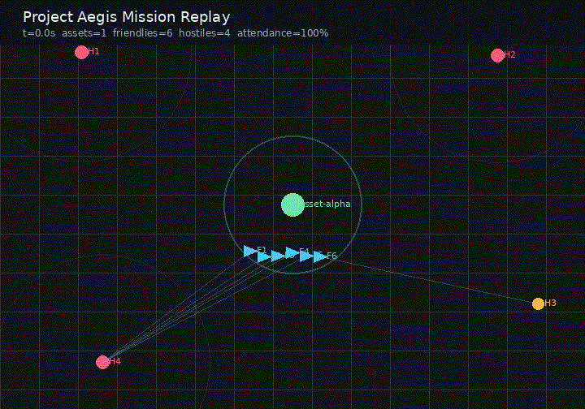
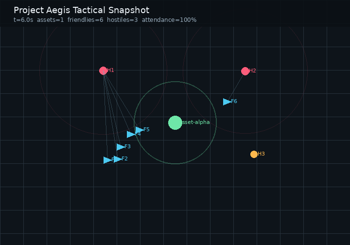

# Project Aegis


Project Aegis is a simulation-first research prototype for decentralized
counter-swarm protection of ground assets. It is designed around the BEL
SIH25164 problem statement: friendly autonomous drones protect designated
assets against hostile drone swarms using local perception, threat
prioritization, and communication-independent coordination.

This repository is intentionally scoped to modelling, simulation, evaluation,
and operator visualization. It does not provide hardware integration,
real-world targeting instructions, or deployable weapon-control logic.

## Demo Preview





Mission recording: [assets/media/mission-recording.mp4](assets/media/mission-recording.mp4)

The visuals above are generated from the reproducible scenario manifest at
`scenarios/baseline_asset_defense.json`, not hand-drawn. The same telemetry
stream is the basis for ROS 2 bag playback and future Isaac Sim or Unreal
Engine rendering.

## Current Objective

Build a credible, reviewable prototype that can be shown as a software
solution architecture to technical evaluators:

- Decentralized per-drone decision loop.
- Threat scoring based on asset risk, time-to-threat, and hostile capability.
- Communication-denied baseline with optional coordination hooks.
- Stochastic simulation runs across randomized scenarios.
- Metrics for asset protection, friendly losses, engagement coverage, and
  intercept quality.
- GUI for visual inspection and demonstrations.
- Tests and documentation suitable for technical review.

## Repository Layout

```text
assets/media/       Generated README images and replay GIFs
aegis/              Core simulation and decision policy package
docs/               Concept notes, architecture, and roadmap
integrations/       ROS 2 bridge skeleton and future renderer integrations
scenarios/          Versioned mission manifests for reproducible runs
tests/              Unit and scenario tests
tools/              Reproducible media and support utilities
web/                Lightweight browser viewer, not the final product renderer
```

## Quick Start

```bash
python3 -m venv .venv
source .venv/bin/activate
pip install -e ".[dev]"
pytest
python3 -m aegis.cli --runs 25 --seed 42
```

Open `web/index.html` in a browser for the lightweight visual demo.
For industrial visualization, use the telemetry route described in
`docs/INDUSTRIAL_SIMULATION_PLAN.md`, `docs/ROS2_BAG_PIPELINE.md`, and
`docs/RENDERING_PIPELINE.md`.

Common reviewer commands:

```bash
make test
make smoke
make report
make scenario-trace
make media
```

To export per-run evaluation data:

```bash
mkdir -p reports
python3 -m aegis.cli --runs 100 --seed 42 --csv reports/baseline-100.csv
python3 -m aegis.cli --runs 1 --seed 42 --trace-jsonl reports/trace-42.jsonl
python3 -m aegis.cli --runs 1 --seed 42 --scenario-config scenarios/baseline_asset_defense.json --trace-jsonl reports/baseline-scenario-trace.jsonl
```

To regenerate README media from the latest scenario trace:

```bash
make media
```

Generated media:

- `assets/media/simulation-pipeline.png`
- `assets/media/mission-snapshot.png`
- `assets/media/mission-replay.gif`
- `assets/media/mission-recording.mp4`
- `assets/media/demo-manifest.json`

## Recording Pipeline

The intended industrial recording path is:

```text
Scenario manifest -> Aegis simulation -> telemetry JSONL -> ROS 2 topics -> rosbag2 -> Isaac Sim / Unreal Engine render
```

Current executable step:

```bash
make scenario-trace
```

ROS 2 bridge skeleton:

```text
integrations/ros2/aegis_msgs
integrations/ros2/aegis_ros_bridge
```

Planned recording command once the ROS 2 workspace is built:

```bash
ros2 bag record /clock /tf /aegis/entities /aegis/metrics -o reports/bags/trace-42
```

High-fidelity rendering is documented in `docs/RENDERING_PIPELINE.md`.

## Engineering Standard

The project is developed in coherent commits, with tests run before push where
practical. The intent is to keep every commit reviewable and every claim backed
by either code, simulation output, or documentation.
